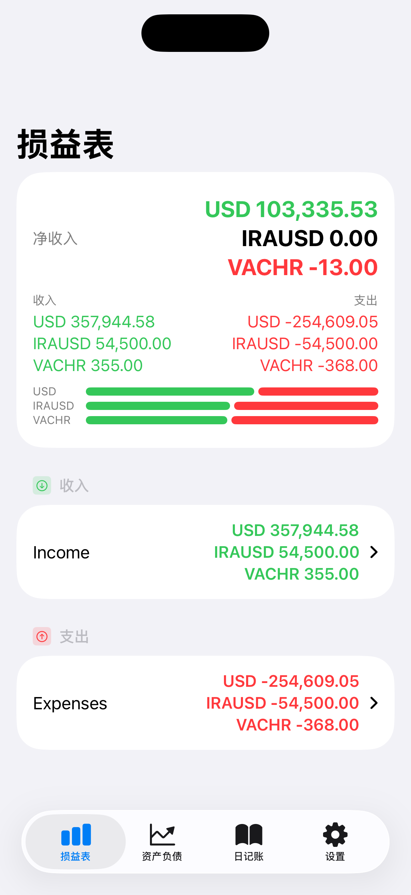

# Counta

Counta 是一个用于在 iPhone 上查看 Beancount 账本的 SwiftUI App。它通过连接你自建的 Fava 服务读取数据，并以「损益表 / 资产负债表 / 日记账 / 设置」四个 Tab 展示（体验类似 Fava）。

## 功能概览（面向用户）

- 连接 Fava（支持可选 Basic Auth）
- 损益表（Income Statement）
- 资产负债表（Balance Sheet）
- 日记账（Journal，支持分页加载）
- 账户详情（从报表/日记账进入）
- 货币显示偏好（符号/代码等）

## 截图



## 使用前准备：运行 Fava

Counta 不直接解析 `.beancount` 文件；它依赖 Fava 提供的接口数据。你需要先在电脑/服务器上运行 Fava，并确保手机能访问到该地址。

一个最小示例（仅供参考）：

```bash
# 安装（示例）
pip install beancount fava

# 启动（局域网可访问：把 host 设为 0.0.0.0）
fava /path/to/your.ledger.beancount --host 0.0.0.0 --port 5000
```

然后在手机浏览器里确认能打开：`http://<你的IP>:5000/`。

## 在 App 中连接 Fava（面向用户）

1. 打开 Counta，首次会进入「欢迎使用 Counta」
2. 在「Fava 地址」输入你的 Fava 地址（示例：`http://192.168.1.10:5000` 或 `https://example.com/fava`）
3. 如需登录，打开「需要登录（Basic Auth）」并填写用户名/密码
4. 点击「开始使用 / 保存」

说明：
- 你既可以填 Fava 首页地址，也可以直接填 API 地址；Counta 会自动解析并定位到 `/api`。
- Basic Auth 密码会保存到 iOS Keychain（设备解锁后可用，且仅限本机）。

## 数据与隐私

- Counta 通过网络从你的 Fava 读取报表与日记账数据；是否暴露到公网完全取决于你的 Fava 部署方式。
- App 仅在本机保存连接信息：Fava 地址保存在 `UserDefaults`，Basic Auth 密码保存在 iOS Keychain。

## 常见问题（Troubleshooting）

- 连接失败/超时：确认手机与 Fava 在同一网络，或你的反向代理/防火墙已放行端口。
- 认证失败（401/403）：检查 Basic Auth 用户名/密码；也确认反向代理是否在拦截 `/api/*`。
- HTTPS 证书问题：若使用自签名证书，iOS 可能拒绝连接；建议使用受信任证书或在局域网使用 HTTP（自行评估风险）。

---

## 开发者指南

### 环境要求

- macOS 14+
- Xcode 15.4+（推荐 Xcode 16+）
- iOS Simulator / 真机（项目的 Deployment Target 以 `Counta.xcodeproj` 中配置为准）
- Swift Package Manager（首次打开/编译会拉取依赖 `SwiftSoup`，需要可用的网络环境）

### 运行项目

1. 用 Xcode 打开 `Counta.xcodeproj`
2. 选择 scheme `Counta`
3. 选择一个 iOS Simulator（或真机）并运行

### 运行测试

如果你偏好命令行（示例）：

```bash
xcodebuild test \
  -project Counta.xcodeproj \
  -scheme Counta \
  -destination 'platform=iOS Simulator,name=iPhone 15'
```

### 目录结构与架构

项目整体采用 SwiftUI + MVVM（`@Observable`）组织代码：

- `Counta/App/`：App 入口与根路由（首次未配置 Fava 会进入引导页）
- `Counta/Features/`：按业务拆分的 Feature（Views / ViewModels / Models / Services）
- `Counta/Core/`：共享模型、组件、服务（Keychain、URL 解析、预览 Mock 等）
- `docs/`：用于开发/预览的接口样例与响应数据

### Fava 接口约定（当前用到）

Counta 以「API Base URL」作为基地址，主要请求：

- `GET /income_statement`
- `GET /balance_sheet`
- `GET /journal_page?page=1&order=desc`
- `GET /account_report?a=<AccountName>&r=journal`

样例与响应结构见：`docs/`。

### SwiftUI Preview（无需真实 Fava）

Debug 环境下，SwiftUI Preview 会自动启用本地 Mock：

- 通过 `URLProtocol` 拦截 `https://preview.fava.local/api/*`
- 从 `docs/**/response.json` 读取数据并返回

相关实现：
- `Counta/Core/Services/PreviewContainer.swift`
- `Counta/Core/Services/PreviewFavaAPI.swift`

### 贡献（Contributing）

欢迎提 Issue / PR。建议：

- 新功能优先放在 `Counta/Features/<Feature>/...`
- View 超过 100 行请拆分
- 避免强制解包 `!`，优先 `guard` 提前返回
- 新增/修改 ViewModel 时补齐单元测试（若测试套件已建立）

## 致谢

- Beancount：<https://beancount.github.io>
- Fava：<https://beancount.github.io/fava/>

## License

本仓库当前未包含 `LICENSE` 文件；在补充许可证之前，默认保留所有权利。若你需要在开源/商用场景使用，请先与作者确认。
